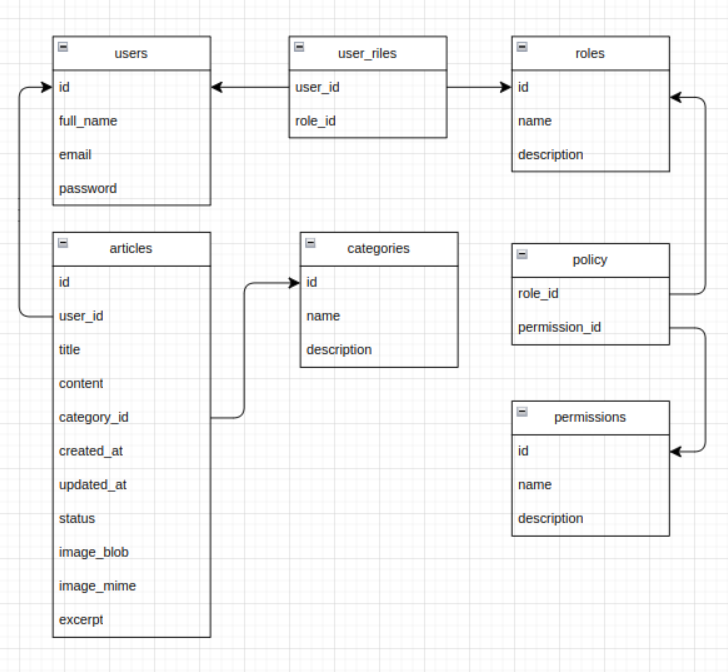

# Blog

Краткое описание проекта.

## Setup

Чтобы начать работу с этим проектом, убедитесь, что на вашем компьютере установлены Docker, Docker Compose, php v8.2 и Composer. 

Все данные для базы в db_data для Docker Compose

Вы можете запустить сервер без установки зависимостей. Папка  vendor уже есть.

### Steps:

1. **Clone the repository**

    ```bash
    git clone https://github.com/khussa1n/blog.git
    cd repository
    ```

2. **Start Docker Compose**

    Выполните следующую команду для создания и запуска контейнеров приложения и базы данных:
    ```bash
    docker-compose up -d --build
    ```

    Эта команда создаст и запустит контейнер для базы данных.


3. **Start Laravel server**

    ```bash
    php artisan serve
    ```

**Stop containers**

Когда вы закончите работу с проектом, вы можете остановить Docker Compose containers с помощью:
   
    ```bash
    docker-compose down
    ```


